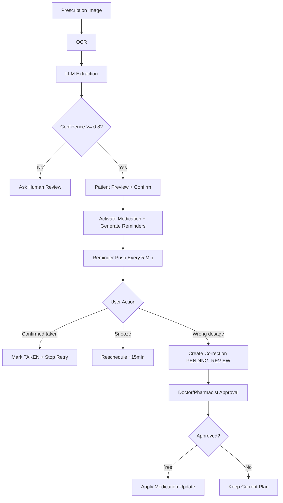
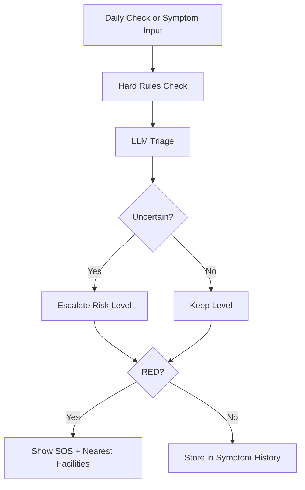

# System Architecture - Vinmec AI Assistant

This document describes MVP architecture aligned with trust/safety constraints in `spec-draft.md`.

## 1. Layers

### Client (Next.js App Router + Tailwind)
- Reminder timeline, prescription review, daily check chat, emergency panel.
- Explicit safety UI: source display, confidence labels, cross-check checkbox, SOS action.

### Server (Next.js Route Handlers + Prisma)
- API route handlers for extraction, reminders, triage, correction workflow, metrics.
- **Reminder scheduler**: cron/background job running in Next.js runtime (no separate worker needed for MVP) — checks due reminders every 5 minutes.
- Approval workflow service for pharmacist/doctor review on medication corrections.

### AI Engine (OCR + LLM + Rule Layer)
- OCR: Pytesseract converts prescription image -> raw text.
- LLM prompt layer: extraction, triage, daily-check.
- Rule layer overrides model output for critical symptoms and uncertainty escalation.

### Data Layer (SQLite + Prisma for MVP)
- Tables: medications, reminders, symptom_logs, correction_logs, facility_cache.
- Idempotency + audit trail for reminder and correction events.

## 2. Safety-Critical Flows

## 3. Triage and Emergency Flow

## 4. Security and Trust Controls

- **Auth (MVP)**: `X-Patient-ID` header on every patient endpoint. Reviewer role uses `X-Reviewer-Token` (hardcoded secret in `.env`).
- RBAC: patient can only access own data; medical reviewer role for approvals.
- LLM never accesses DB directly; it only receives curated input from server route handlers.
- PHI masking in logs; strict output schema parsing to guard against prompt injection.

## 5. Reliability Controls

- Hard rules override LLM output for critical symptom keywords.
- If uncertain, system escalates risk level instead of downplaying.
- Reminder operations are idempotent to avoid duplicate confirm/snooze writes.
- Safety metrics tracked:
  - `clinical_precision`
  - `low_confidence_reject_rate`
  - `cross_check_adherence`
  - `high_confidence_failure_rate`
